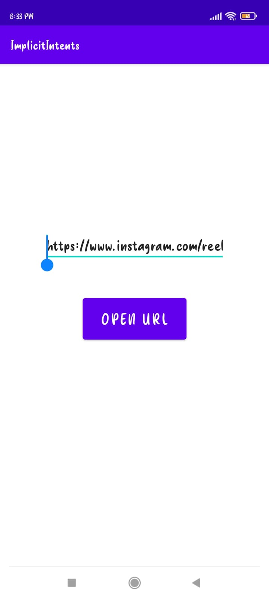
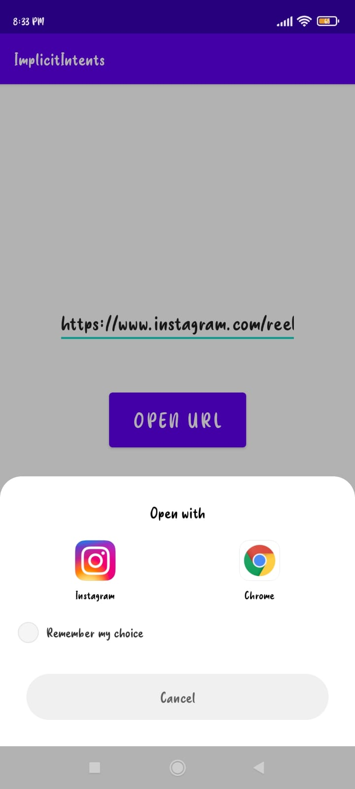

# ImplecitIntentsApp

***This 'ImplecitIntentsApp Android App' using Java is created by Ankita Sikder, student of BTECH, in University of Engineering and Management, Kolkata.***

**Email Id: ankita.sikder14@gmail.com.** 

<p align="left">
<a href="https://facebook.com/ankita.sikder.104" target="blank"></a>
<a href="https://instagram.com/ankita.sikder14" target="blank"></a>
<a href="https://github.com/ankitasikder" target="blank"></a>
</p>

[](https://shields.io/) [](https://shields.io/) [](https://shields.io/) [](https://shields.io/) [](https://shields.io/)  

## About :point_down: 

<div align="justified">

This is a basic android app created using java. Here we have to paste any valid uniform resource locator and the link can be opened by pressing 'OPEN URL' button. After clicking on it the options on that device to open that link will be shown. It is basically practice to make implecit intents in android development. This app can be used to open any url very easily. 
      
</div>

## Folder Structure :point_down:
```bash
ImplecitIntentsApp
      └── app
           └── src
                └── main
                      ├── AndroidManifest.xml
                      └── java/com/example/implecitintentsapp
                                     └── MainActivity.java 
 ```             
## Screenshots of this app :point_down: 

<div align="center">
 
<a href="pics/p1.jpeg"></a> <a href="pics/p2.jpeg"></a> <a href="pics/p3.jpeg"></a>


</div>

         


